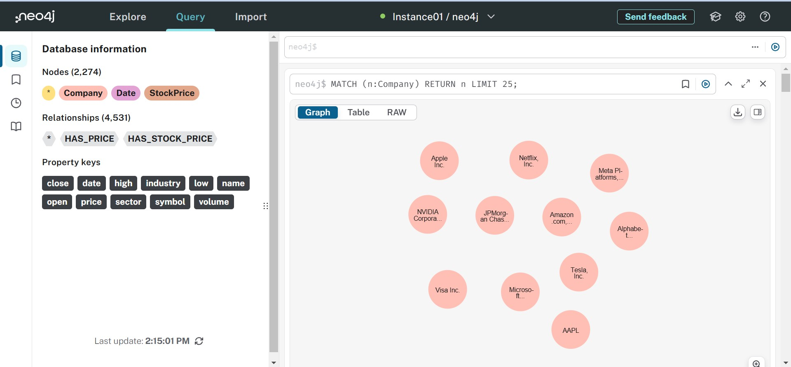
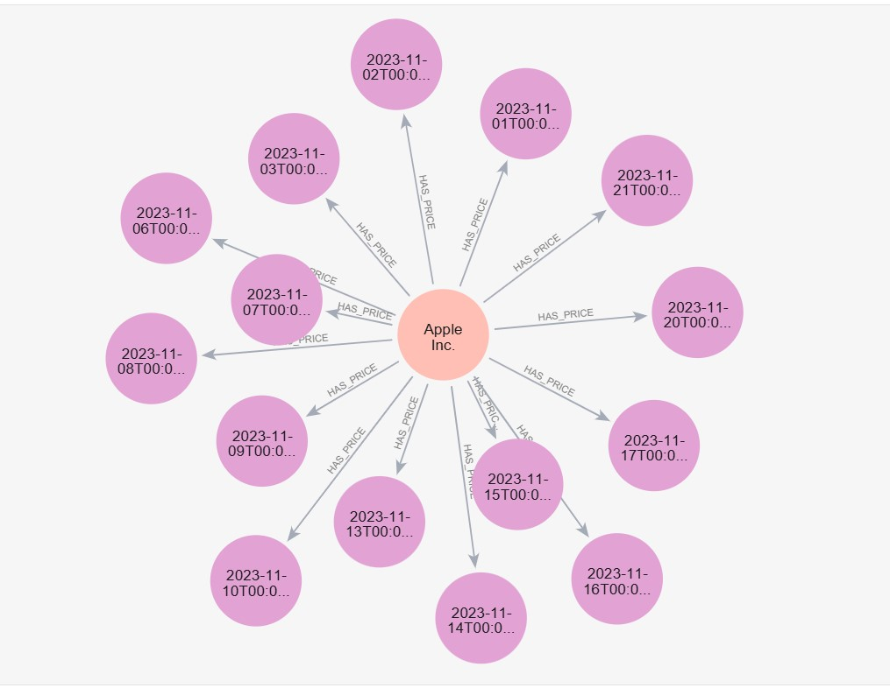

# Financial Market Analysis System

## Overview

The **Financial Market Analysis System** aims to develop a robust solution for retrieving and analyzing financial market data using memory and knowledge graphs. This system facilitates multi-query tasks, empowering users to explore historical stock data and derive insights through a comprehensive dashboard interface.

## Features

- **Data Retrieval and Storage**: Fetches historical stock data for companies using the Yahoo Finance API and stores it in a Neo4j graph database for structured analysis.
- **Graph Database**: Stores company and stock price data in Neo4j, enabling efficient and structured queries over time-series financial data.
- **Conversational Interaction with Memory**: Incorporates memory to retain context from past queries, allowing follow-up questions and interactions to build on previous responses.
- **Natural Language Generation**: Uses a pre-trained BART model to generate conversational responses, creating a seamless, human-like interaction for financial data retrieval.
- **Colab-Friendly Environment**: Designed for execution on Google Colab, with easy setup and cloud-based environment compatibility.

## Data Stored in the Graph Database

The system stores detailed information about publicly traded companies, their stock prices, and related financial metrics. Below is a summary of the data structure and the relationships represented in the graph database.

*Apple, Microsoft, Tesla, Alphabet (Google), Amazon.com, Meta Platforms (Facebook), Netflix, NVIDIA Corporation, JPMorgan.*

### Database Information

- **Total Nodes:** 2,274
  - **Company Nodes**: Represents individual companies, each with properties such as name, symbol, industry, and sector.
  - **StockPrice Nodes**: Represents daily stock price data, including attributes for open, close, high, low prices, and volume.
  - **Date Nodes**: Represents specific dates for the stock price entries.

- **Total Relationships:** 4,531
  - **HAS_PRICE**: Links a company to its stock price information.
  - **HAS_STOCK_PRICE**: Connects stock price data to the respective date of that price.

#### Example Visualization of Company Nodes

*This image shows the nodes representing various companies in the database.*

#### Example Visualization of Stock Price Relationships

*This image illustrates the relationships between companies and their stock price data.*

### Conclusion

The Financial Market Analysis System is designed to offer users a powerful tool for interacting with financial data. By leveraging memory and knowledge graphs, the system not only provides insights into historical data but also enhances the analysis process, allowing for a deeper understanding of the financial landscape.

