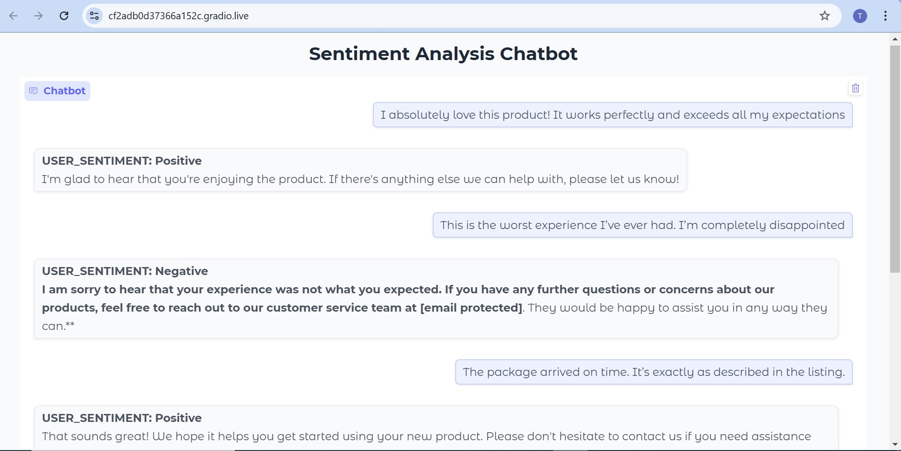
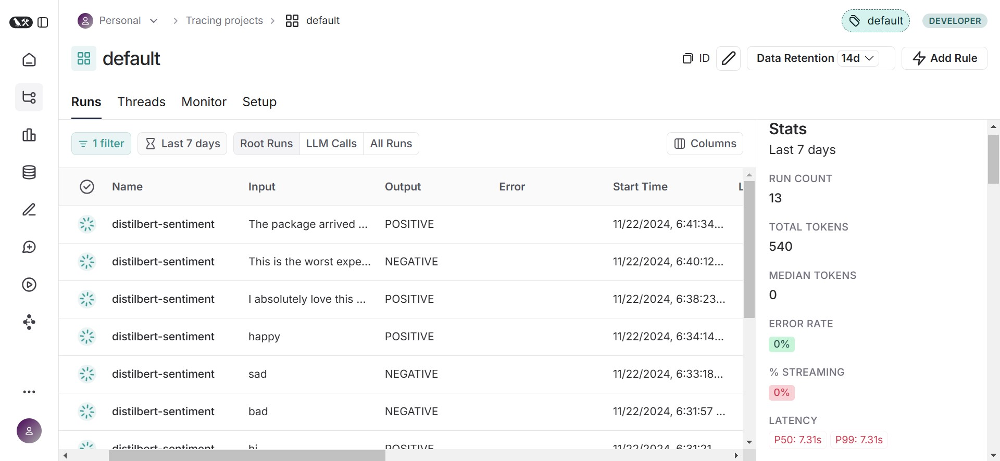
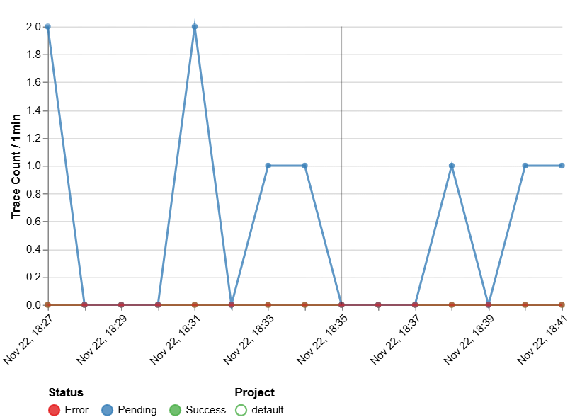
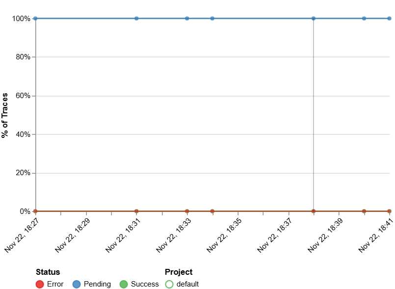

# Sentiment Analysis Chatbot

This repository contains the code and resources for a **Sentiment Analysis Chatbot** using **OpenVINO** for performance optimization, **Transformers** for model loading, and **Gradio** for the user interface. The chatbot is designed to engage in dynamic conversations and adjust its tone based on the sentiment of the user input.

## Features:
- **Sentiment Analysis**: Analyze the sentiment of user messages (Positive, Negative, or Neutral) using a fine-tuned BERT model (`distilbert-base-uncased-finetuned-sst-2-english`).
- **Chatbot with Sentiment Awareness**: The chatbot adjusts its tone based on the sentiment of the user's message.
- **OpenVINO Optimization**: The models are optimized for CPU performance using OpenVINO, providing efficient responses.
- **Gradio UI**: An interactive interface allowing users to chat with the bot and view sentiment labels in real-time.
- **Langsmith Tracing**: Logs and traces model inputs and outputs for evaluation and performance monitoring.

# Chatbot Output and Langsmith Tracing

## Chatbot Output:
Here's a sample output of the chatbot, which adjusts its tone based on the sentiment of the user input:

## Langsmith Tracing:
We also log the performance and tracing data of the model using **Langsmith** for continuous evaluation. Below are some key statistics:

### Trace Count:
- **Number of traces**: Indicates the number of distinct processes initiated.
  

- **LLM Call Count**: Tracks the number of times the LLM (Language Model) was called.
  

- **Trace Success Rates**: Percentage of successful traces out of total traces. This helps gauge system reliability.
  

## Conclusion

By combining sentiment analysis and performance tracking, this chatbot can not only understand user emotions but also improve over time, delivering more meaningful and contextually appropriate interactions.

